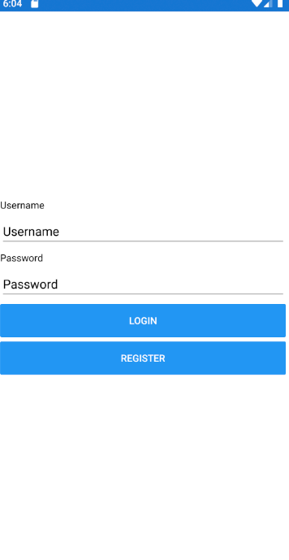
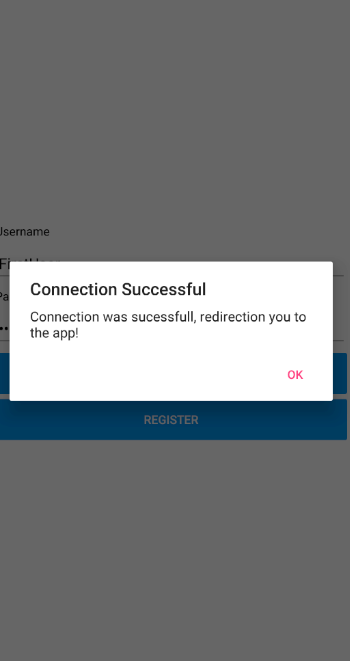
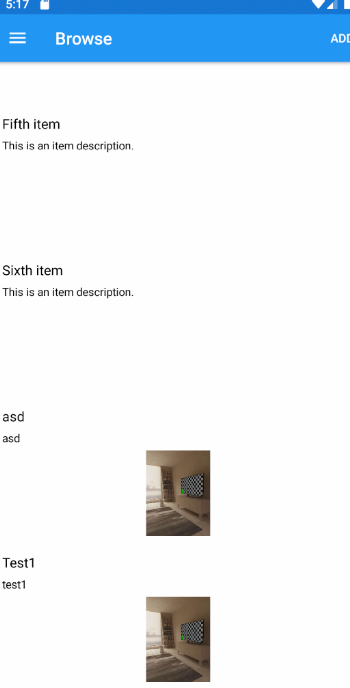
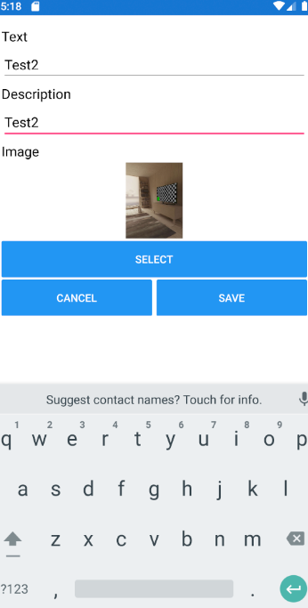
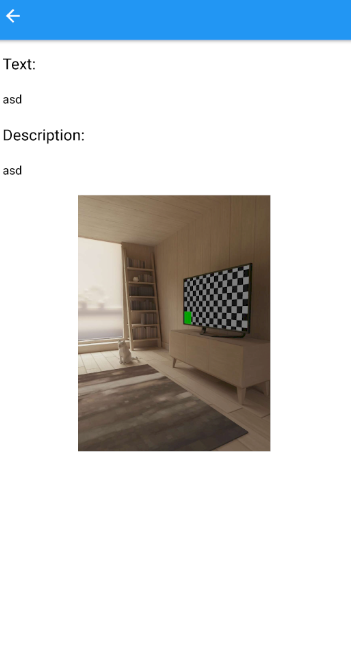
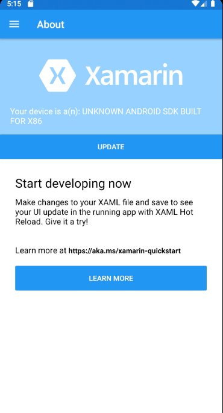

# BEIER360 Interview Test
## Contents
- [Thoughts](https://github.com/ashleyswanson360-org/beier360-interview-test/blob/main/README.md#thought)
- [New App Features](https://github.com/ashleyswanson360-org/beier360-interview-test/blob/main/README.md#newappfeatures)
- [Tasks](https://github.com/ashleyswanson360-org/beier360-interview-test/blob/main/README.md#tasks)
  - [Task 1 - Fix](https://github.com/ashleyswanson360-org/beier360-interview-test/blob/main/README.md#tasks)
  - [Task 2 - Improve](https://github.com/ashleyswanson360-org/beier360-interview-test/blob/main/README.md#tasks)
  - [Task 3 - Implement](https://github.com/ashleyswanson360-org/beier360-interview-test/blob/main/README.md#tasks)
  - [Task 4 - Advanced (Optional)](https://github.com/ashleyswanson360-org/beier360-interview-test/blob/main/README.md#tasks)
- [How to Submit](https://github.com/ashleyswanson360-org/beier360-interview-test/blob/main/README.md#how-to-submit)
- [Support](https://github.com/ashleyswanson360-org/beier360-interview-test/blob/main/README.md#support)

## Thoughts
First of all, thank you for the opportunity given to do this task. 
I think I learned a lot by doing this since I have no background in Xamarin. 
In the beginning, I had some difficulties with the bug fix of the dependency since it was something that I never touched, after some research, I found that Xamarin is very similar to c# something that I've worked on in Portugal for three years.
 I want to thank you all for this chance, I don't know if I will be chosen for the job but it was really fun working with something new and learning a new language. It is something that I will use in the future. 
 Finally, I think this task reflects my knowledge and drive to learn new stuff and if I'm accepted I will give 100% like I always do.

### New App Features

New Login page with users added

Added Images on Browser page

### Bug Fixes
Fixed the bug in About page, now shows your device

## Tasks
There are four tasks to complete.

1. **Fix:**
When pressing the Update button on the About page, to load the device's make and model, the app crashes. You need to debug and solve this issue.- **Completed**

2. **Improve:**
Make an improvement to any of the three existing features. This could be cleaning or optimising the code, or improving the user experience.- **Completed**

3. **Implement:**
Add a new feature to the app. Make sure you adhere to any third-party licences, and attribute any work that is not your own.
It should not require any preparation from us to test it. We should be able to download and immediately run your app.- **Completed**

4. **Advanced (optional):**
By default, the Items feature does not persist changes between sessions. The `InterviewApp.Advanced` library provides an implementation of the data store that persists the items to the device using EF Core and a SQLite database.
You can switch to use this advanced data store by defining the `ADVANCED` compilation symbol in the `InterviewApp` project settings. (Or you can uncomment the `DefineConstants` line when manually editing the `InterviewApp.csproj` file).
When using this advanced data store, the app will log an error when opening the Items page and will crash when trying to add a new item. You need to debug and solve this issue.- **Completed**
	
Please document your work and your thought-process, through commits, comments or just a log in a .txt file.

### FAQs

**How long should this test take me?**

First of all, it's important to note that it can take different people varying amounts of time to complete the test. This could be because of your experience level, or just simply having more important things going on in your life. We don't want this to feel like an exam, but hope it's an interesting showcase of some typical tasks you will be undertaking at BEIER360, while also showing us your skill level in the sort of work we do. Please give us any feedback you have if you feel the test is too much.

To answer the question, assuming you spend your whole evenings on the test, we estimate it could take 1 or 2 nights to complete if you already have Xamarin experience. If you don't have experience with Xamarin or C# then it could take you an extra night or 2 to get to grips with it, depending on your experience level. Bare in mind that this is an estimate. As more people complete the test we should be able to improve that based on the real world data.

The important thing is, this _DOES NOT_ mean that you have a hard deadline of 4 days after receiving the invitation. Realistically, working around your schedule, we would expect a response in a week or so.

### Contact
If you need any help or guidance you can contact our Lead Software Developer, Ashley, by emailing him at `ashley.swanson@beier360.com`.
